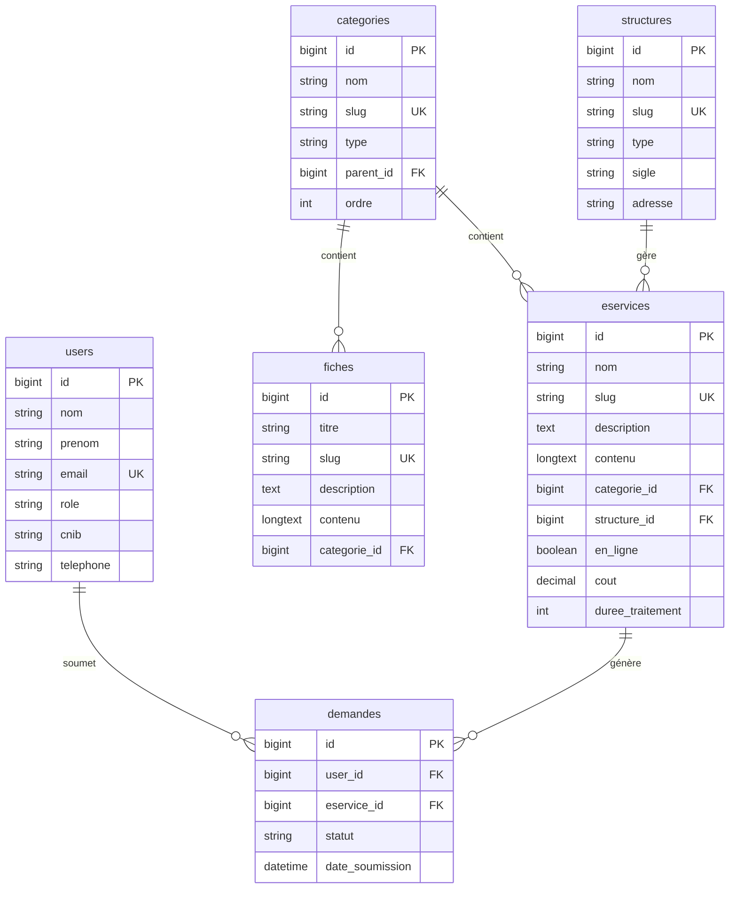

# Documentation Technique - Service Public BF

## Table des matières

1. [Vue d'ensemble du projet](#vue-densemble-du-projet)
2. [Architecture technique](#architecture-technique)
3. [Base de données](#base-de-données)
4. [Seeders et données](#seeders-et-données)
5. [Contrôleurs](#contrôleurs)
6. [Vues et Design System](#vues-et-design-system)
7. [Routes](#routes)
8. [Comptes de test](#comptes-de-test)
9. [Déploiement](#déploiement)

---

## Vue d'ensemble du projet

**Service Public BF** est un portail web gouvernemental pour le Burkina Faso permettant aux citoyens et entreprises d'accéder aux services administratifs en ligne.

### Technologies utilisées

- **Framework** : Laravel 11
- **PHP** : 8.3.30
- **Base de données** : MySQL
- **Frontend** : Blade Templates + Bootstrap 5
- **Design** : Système "Sovereign OS" personnalisé

### Fonctionnalités principales

- 📋 Catalogue de démarches administratives (Particuliers & Entreprises)
- 💻 E-Services en ligne (69 services disponibles)
- 📄 Documents officiels (lois, décrets, arrêtés)
- 📞 Annuaire des structures publiques
- ❓ FAQ
- 🔍 Recherche globale
- 👤 Espace personnel (Dashboard)
- 🔐 Authentification multi-rôles (Admin, Agent, Citoyen)

---

## Architecture technique

### Structure MVC

```
app/
├── Http/
│   ├── Controllers/
│   │   ├── HomeController.php          # Page d'accueil, recherche
│   │   ├── AuthController.php          # Authentification, profil
│   │   ├── DashboardController.php     # Tableaux de bord
│   │   ├── ParticulierController.php   # Services particuliers
│   │   ├── EntrepriseController.php    # Services entreprises
│   │   ├── EserviceController.php      # E-services
│   │   ├── AnnuaireController.php      # Annuaire
│   │   ├── DocumentController.php      # Documents officiels
│   │   ├── FaqController.php           # FAQ
│   │   └── ActualiteController.php     # Actualités
│   └── Middleware/
├── Models/
│   ├── User.php
│   ├── Categorie.php
│   ├── Fiche.php
│   ├── Eservice.php
│   ├── Structure.php
│   ├── Document.php
│   ├── Faq.php
│   ├── Actualite.php
│   └── Demande.php
└── Providers/
    └── AppServiceProvider.php          # Pagination Bootstrap 5
```

### Modèles de données

#### User
- Rôles : `admin`, `agent`, `citoyen`
- Champs : `nom`, `prenom`, `email`, `telephone`, `cnib`, `role`

#### Categorie
- Types : `particulier`, `entreprise`
- Hiérarchie : catégories parentes/enfants
- Champs : `nom`, `slug`, `type`, `description`, `icone`, `ordre`

#### Fiche
- Démarches administratives détaillées
- Liée à une catégorie
- Champs : `titre`, `slug`, `description`, `contenu`, `pieces_requises`

#### Eservice
- Services en ligne
- Liée à une catégorie et une structure
- Champs : `nom`, `slug`, `description`, `contenu`, `en_ligne`, `cout`, `duree_traitement`

#### Structure
- Ministères, directions, institutions
- Types : `ministere`, `direction`, `institution`
- Champs : `nom`, `sigle`, `type`, `adresse`, `telephone`, `email`

#### Document
- Documents officiels
- Types : `loi`, `decret`, `arrete`, `circulaire`, `note_service`
- Champs : `titre`, `numero`, `type`, `date_signature`, `fichier`

---

## Base de données

### Schéma relationnel



### Migrations

Les migrations se trouvent dans `database/migrations/` :

- `2024_01_01_000001_create_users_table.php`
- `2024_01_01_000002_create_categories_table.php`
- `2024_01_01_000003_create_structures_table.php`
- `2024_01_01_000004_create_fiches_table.php`
- `2024_01_01_000005_create_eservices_table.php`
- `2024_01_01_000006_create_documents_table.php`
- `2024_01_01_000007_create_faqs_table.php`
- `2024_01_01_000008_create_actualites_table.php`
- `2024_01_01_000009_create_demandes_table.php`

---

## Seeders et données

### Ordre d'exécution (DatabaseSeeder)

```php
UserSeeder::class,              // 1. Utilisateurs de test
StructureSeeder::class,         // 2. Ministères et institutions
CategorieSeeder::class,         // 3. Catégories de services
FicheSeeder::class,             // 4. Fiches de démarches
EserviceSeeder::class,          // 5. E-services de base
CsvDataImportSeeder::class,     // 6. Import CSV (compléments)
DeduplicateEservicesSeeder::class, // 7. Déduplication automatique
DocumentSeeder::class,          // 8. Documents officiels
FaqSeeder::class,               // 9. Questions fréquentes
ActualiteSeeder::class,         // 10. Actualités
```

### CsvDataImportSeeder

**Fichier** : `database/seeders/CsvDataImportSeeder.php`

**Rôle** : Importer les e-services depuis les fichiers CSV fournis.

**Fichiers CSV traités** :
- `extract-data-2026-01-31.csv`
- `extract-data-2026-01-31 (1).csv`

**Logique** :
1. Lit les fichiers CSV ligne par ligne
2. Crée une catégorie par défaut "Services en ligne" si nécessaire
3. Pour chaque service :
   - Génère un slug unique
   - Recherche ou crée la structure (ministère) associée
   - Crée l'e-service avec tous les champs requis
4. Affiche un rapport d'import (services importés/ignorés)

**Commande** :
```bash
php artisan db:seed --class=CsvDataImportSeeder
```

### DeduplicateEservicesSeeder

**Fichier** : `database/seeders/DeduplicateEservicesSeeder.php`

**Rôle** : Supprimer les doublons dans les e-services.

**Logique** :
1. Récupère tous les e-services
2. Normalise les noms (sans accents, espaces, majuscules)
3. Pour chaque doublon détecté :
   - Compare les descriptions
   - Garde celui avec la description la plus complète
   - Supprime l'autre
4. Affiche un rapport (doublons supprimés, services uniques conservés)

**Commande** :
```bash
php artisan db:seed --class=DeduplicateEservicesSeeder
```

---

## Contrôleurs

### HomeController

**Méthodes principales** :

- `index()` : Page d'accueil avec catégories, e-services, documents, actualités
- `recherche()` : Recherche globale (fiches, e-services, documents, structures)
- `suivi()` : Formulaire de suivi de demande
- `verifierSuivi()` : Vérification du statut d'une demande

### AuthController

**Méthodes principales** :

- `showLogin()` : Formulaire de connexion
- `login()` : Authentification
- `showRegister()` : Formulaire d'inscription
- `register()` : Création de compte
- `logout()` : Déconnexion
- `profil()` : Page de profil utilisateur
- `updateProfil()` : Mise à jour du profil
- `updatePassword()` : Changement de mot de passe

### DashboardController

**Méthodes principales** :

- `index()` : Redirection vers le dashboard approprié selon le rôle
- `dashboardAdmin()` : Tableau de bord administrateur
- `dashboardAgent()` : Tableau de bord agent
- `dashboardCitoyen()` : Tableau de bord citoyen
- `demandes()` : Liste des demandes
- `showDemande($id)` : Détails d'une demande
- `updateDemande($id)` : Mise à jour du statut d'une demande
- `notifications()` : Liste des notifications

### EserviceController

**Méthodes principales** :

- `index()` : Liste de tous les e-services
- `show($slug)` : Détails d'un e-service
- `demande($slug)` : Formulaire de demande
- `soumettreDemande($slug)` : Soumission d'une demande

---

## Vues et Design System

### Système de design "Sovereign OS"

**Fichier CSS** : `public/css/app.css`

#### Variables CSS

```css
:root {
    /* Couleurs nationales Burkina Faso */
    --bf-rouge: #EF2B2D;
    --bf-vert: #009E49;
    --bf-jaune: #FCD116;
    
    /* Couleurs dérivées */
    --bf-rouge-fonce: #C41E3A;
    --bf-vert-fonce: #006B3F;
    --bf-vert-pale: rgba(0, 158, 73, 0.1);
    
    /* Typographie */
    --font-primary: 'Inter', sans-serif;
    --font-secondary: 'Roboto', sans-serif;
}
```

#### Classes principales

**Sections** :
- `.section` : Conteneur de section avec padding
- `.section-title` : Titre de section centré
- `.barre` : Barre décorative sous les titres

**Cartes** :
- `.card-categorie` : Carte de catégorie avec icône
- `.card-eservice` : Carte d'e-service
- `.card-document` : Carte de document
- `.card-fiche` : Carte de fiche

**Hero** :
- `.hero` : Section hero avec gradient
- `.recherche-hero` : Barre de recherche principale

**Badges** :
- `.badge-sp` : Badge Service Public
- `.badge-en-ligne` : Badge "EN LIGNE"

### Structure des vues

```
resources/views/
├── layouts/
│   └── app.blade.php               # Layout principal
├── pages/
│   ├── home/
│   │   └── index.blade.php         # Page d'accueil
│   ├── auth/
│   │   ├── login.blade.php
│   │   ├── register.blade.php
│   │   └── profil.blade.php
│   ├── dashboard/
│   │   ├── admin/
│   │   │   └── index.blade.php
│   │   ├── agent/
│   │   │   └── index.blade.php
│   │   ├── citoyen/
│   │   │   └── index.blade.php
│   │   ├── demandes/
│   │   │   ├── index.blade.php
│   │   │   └── show.blade.php
│   │   └── notifications.blade.php
│   ├── particuliers/
│   │   ├── index.blade.php
│   │   ├── categorie.blade.php
│   │   └── fiche.blade.php
│   ├── entreprises/
│   │   ├── index.blade.php
│   │   ├── categorie.blade.php
│   │   └── fiche.blade.php
│   ├── eservices/
│   │   ├── index.blade.php
│   │   ├── show.blade.php
│   │   └── demande.blade.php
│   ├── documents/
│   │   ├── index.blade.php
│   │   └── show.blade.php
│   ├── annuaire/
│   │   ├── index.blade.php
│   │   └── show.blade.php
│   ├── faq/
│   │   └── index.blade.php
│   ├── suivi/
│   │   └── index.blade.php
│   ├── actualites/
│   │   └── show.blade.php
│   └── recherche/
│       └── index.blade.php
└── components/                     # Composants réutilisables
```

---

## Routes

**Fichier** : `routes/web.php`

### Routes publiques

```php
GET  /                          # Accueil
GET  /recherche                 # Recherche
GET  /suivi                     # Suivi de demande
POST /suivi                     # Vérification de suivi
POST /contact                   # Formulaire de contact
```

### Routes Particuliers

```php
GET /particuliers                           # Liste des catégories
GET /particuliers/categorie/{slug}          # Catégorie spécifique
GET /particuliers/categorie/{cat}/{fiche}   # Fiche de démarche
```

### Routes Entreprises

```php
GET /entreprises                            # Liste des catégories
GET /entreprises/categorie/{slug}           # Catégorie spécifique
GET /entreprises/categorie/{cat}/{fiche}    # Fiche de démarche
```

### Routes E-Services

```php
GET  /eservices                 # Liste des e-services
GET  /eservices/{slug}          # Détails d'un e-service
GET  /eservices/{slug}/demande  # Formulaire de demande
POST /eservices/{slug}/demande  # Soumission de demande
```

### Routes Annuaire

```php
GET /annuaire                   # Liste des structures
GET /annuaire/structure/{slug}  # Détails d'une structure
```

### Routes Documents

```php
GET /documents                  # Liste des documents
GET /documents/{slug}           # Détails d'un document
GET /documents/{slug}/download  # Téléchargement
```

### Routes Authentification

```php
GET  /login                     # Formulaire de connexion
POST /login                     # Authentification
GET  /register                  # Formulaire d'inscription
POST /register                  # Création de compte
POST /logout                    # Déconnexion
GET  /profil                    # Profil utilisateur (auth)
PUT  /profil                    # Mise à jour profil (auth)
PUT  /profil/password           # Changement mot de passe (auth)
```

### Routes Dashboard (protégées)

```php
GET /dashboard                  # Dashboard principal (auth)
GET /dashboard/demandes         # Liste des demandes (auth)
GET /dashboard/demandes/{id}    # Détails d'une demande (auth)
PUT /dashboard/demandes/{id}    # Mise à jour demande (auth)
GET /dashboard/notifications    # Notifications (auth)
```

---

## Comptes de test

### Administrateur

- **Email** : `admin@servicepublic.gov.bf`
- **Mot de passe** : `password`
- **Rôle** : `admin`

### Agent

- **Email** : `agent@servicepublic.gov.bf`
- **Mot de passe** : `password`
- **Rôle** : `agent`

### Citoyen

- **Email** : `citoyen1@example.com`
- **Mot de passe** : `password`
- **Rôle** : `citoyen`

---

## Déploiement

### Prérequis

- PHP 8.2 ou supérieur
- Composer
- MySQL 5.7 ou supérieur
- Node.js et NPM

### Installation

1. **Cloner le projet**
   ```bash
   git clone <repository>
   cd servicepublic-bf
   ```

2. **Installer les dépendances**
   ```bash
   composer install
   npm install
   ```

3. **Configuration**
   ```bash
   cp .env.example .env
   php artisan key:generate
   ```

4. **Configurer la base de données**
   
   Éditer `.env` :
   ```env
   DB_CONNECTION=mysql
   DB_HOST=127.0.0.1
   DB_PORT=3306
   DB_DATABASE=servicepublic_bf
   DB_USERNAME=root
   DB_PASSWORD=
   ```

5. **Créer la base de données**
   ```bash
   mysql -u root -p
   CREATE DATABASE servicepublic_bf;
   exit;
   ```

6. **Migrer et peupler**
   ```bash
   php artisan migrate:fresh --seed
   ```

7. **Compiler les assets**
   ```bash
   npm run build
   ```

8. **Lancer le serveur**
   ```bash
   php artisan serve
   ```

9. **Accéder à l'application**
   
   Ouvrir : `http://localhost:8000`

### Export du projet

Un script PowerShell `export_project.ps1` est fourni pour exporter le projet :

```powershell
.\export_project.ps1
```

Ce script :
- Exporte la base de données en SQL
- Archive le code source (sans `vendor` et `node_modules`)
- Crée un fichier ZIP prêt pour le transfert

### Guide de réimportation

Voir `EXPORT_GUIDE.md` pour les instructions détaillées de déploiement sur un nouveau serveur.

---

## Maintenance

### Commandes utiles

**Réinitialiser la base de données** :
```bash
php artisan migrate:fresh --seed
```

**Importer uniquement les CSV** :
```bash
php artisan db:seed --class=CsvDataImportSeeder
```

**Dédupliquer les e-services** :
```bash
php artisan db:seed --class=DeduplicateEservicesSeeder
```

**Vider le cache** :
```bash
php artisan cache:clear
php artisan config:clear
php artisan route:clear
php artisan view:clear
```

---

## Support et Contact

Pour toute question technique, consulter :
- La documentation Laravel : https://laravel.com/docs
- Le guide d'export : `EXPORT_GUIDE.md`
- Les seeders : `database/seeders/`

---

**Version** : 1.0  
**Date** : Février 2026  
**Auteur** : Service Public BF - Équipe Technique
